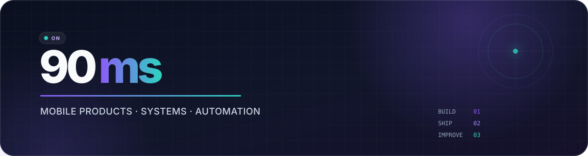
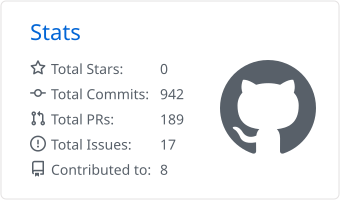
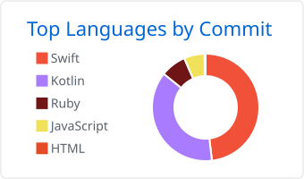
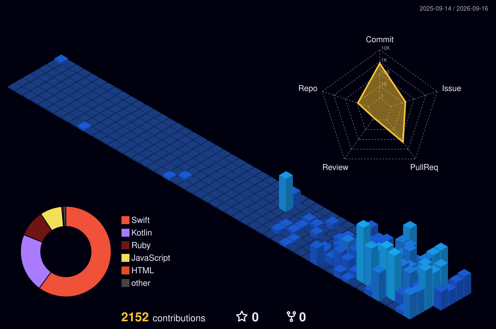

  

  <strong>모바일 경험을 설계하고 지속 가능한 제품과 시스템으로 구현합니다.</strong> 
  반복되는 엔지니어링 과정은 자동화하며, <strong>Kotlin Multiplatform</strong>과 <strong>AI 에이전트 워크플로</strong>에 집중하고 있습니다.

  <a href="https://github.com/90ms?tab=repositories">Repositories</a>
  &nbsp;·&nbsp;
  <a href="https://90ms.github.io/beez-design/">Design System</a>
  &nbsp;·&nbsp;
  <a href="https://github.com/90ms?tab=stars">Interests</a>

 

## Tech & Tools

  <strong>Core & Mobile</strong> 
  
  
  
  
  
  

  <strong>Ecosystem & Automation</strong> 
  
  
  
  

 

## Activity

  <picture>
    <source media="(prefers-color-scheme: dark)" srcset="./profile-summary-card-output/github_dark/3-stats.svg" />
    <source media="(prefers-color-scheme: light)" srcset="./profile-summary-card-output/github/3-stats.svg" />
    
  </picture>
  <picture>
    <source media="(prefers-color-scheme: dark)" srcset="./profile-summary-card-output/github_dark/2-most-commit-language.svg" />
    <source media="(prefers-color-scheme: light)" srcset="./profile-summary-card-output/github/2-most-commit-language.svg" />
    
  </picture>

  
<strong>Contribution Landscape (3D)</strong>

   
  

    
  

 

  Build small · Learn fast · Automate the repeatable

